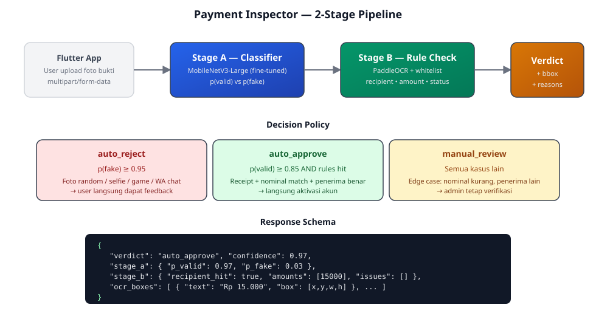
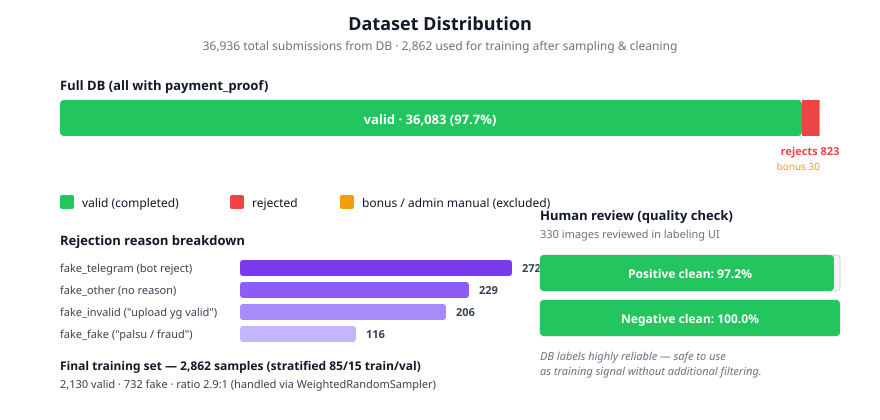
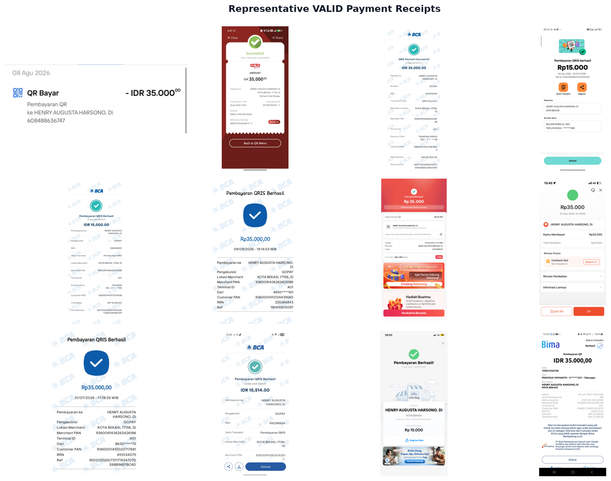
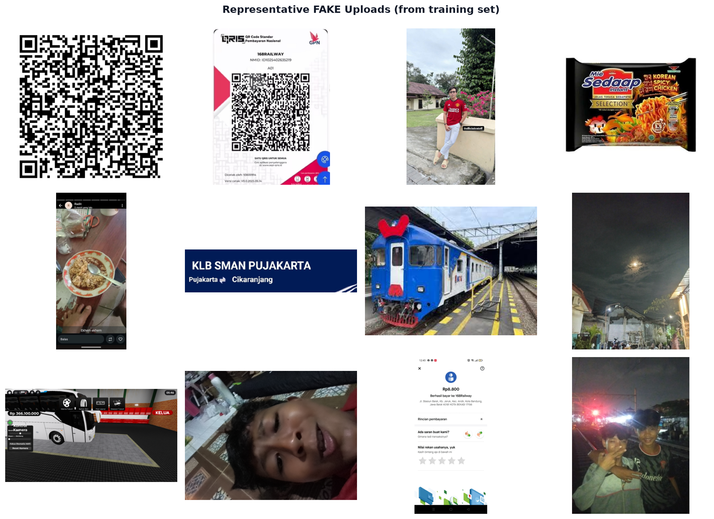
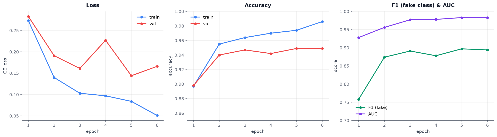

<div align="center">

# 168Railway — Payment Inspector

**ML-powered payment proof validator untuk aplikasi 168Railway.**  
Inspector memeriksa setiap bukti bayar yang di-upload user, menentukan apakah valid, palsu, atau perlu review manual — dan menyorot bagian receipt mana yang salah.

[](https://www.python.org/)
[](https://pytorch.org/)
[](https://fastapi.tiangolo.com/)
[](https://flutter.dev/)

</div>

---

## Masalah

168Railway menerima **~37.000 bukti pembayaran** dalam ~2 tahun terakhir, dengan beberapa pola fake yang berulang:

- Foto random — selfie, lokomotif KAI, screenshot game Roblox, mainan rel
- Screenshot halaman QR instruksi bayar (bukan hasil transaksi)
- Homepage e-wallet tanpa riwayat transaksi
- Receipt **asli** tapi transfer ke merchant lain (bukan 168Railway)
- Nominal tidak sesuai paket

Dan admin harus manual verifikasi semua. **Inspector** mengambil alih 80% kasus clear-cut, menyisakan edge case untuk admin.

---

## Arsitektur

<div align="center">



</div>

**Stage A — Visual classifier** menolak upload yang jelas-jelas bukan receipt (selfie, foto random, QR instruksi). Model: MobileNetV3-Large fine-tune dari ImageNet.

**Stage B — OCR + rule check** untuk receipt yang lolos Stage A. PaddleOCR mengekstrak nominal, nama penerima, status transaksi. Lalu cocokkan dengan whitelist:
- Nama penerima mengandung `HENRY AUGUSTA HARSONO` atau `168Railway`
- Nominal match plan amount (5rb / 9.9rb / 12rb / 15rb / 25rb / 35rb / dst)
- Ada success marker (`Berhasil`, `Sukses`, `Successful`, `Diterima`)
- Lokasi merchant match (Jl. Stasiun Barat / Kota Bekasi / 40181)

---

## Dataset

<div align="center">



</div>

Label berasal dari status DB (completed vs rejected), diperkaya dengan parsing `rejection_reason` untuk subcategorize. 330 image di-review manual untuk validasi label quality:

| Class | DB label | Human review clean rate |
|---|---|---|
| **Valid** (receipt asli) | 36.083 completed | **97.2%** |
| **Fake** (semua subkategori) | 823 rejected | **100%** |
| Excluded | 30 bonus/manual | — |

Noise 2.8% di positive berasal dari admin yang approve manual padahal receipt tidak sesuai (edge case: transfer ke orang lain, nominal kurang) — model akan belajar untuk flag kasus ini sebagai `manual_review`, bukan auto-approve.

### Contoh training samples

<table>
<tr>
<td align="center"><b>VALID receipts (positive class)</b></td>
<td align="center"><b>FAKE uploads (negative class)</b></td>
</tr>
<tr>
<td></td>
<td></td>
</tr>
</table>

---

## Training Results

<div align="center">



</div>

Model fine-tuned dari MobileNetV3-Large (ImageNet). Training: 15 epoch, AdamW + Cosine LR, strong augmentation (perspective, color jitter, blur, rotation) untuk cover screenshot vs foto-of-screen modalities.

Metrics dilacak di validation set stratified (430 samples, 15%):

| Metric | Target | Latest |
|---|---|---|
| **Val accuracy** | ≥ 94% | *(see training_curves.png)* |
| **F1 (fake class)** | ≥ 0.85 | *(see training_curves.png)* |
| **AUC** | ≥ 0.97 | *(see training_curves.png)* |
| **Precision (fake)** | ≥ 0.90 | *(see training_curves.png)* |

Model terbaik di-save ke `models/stage_a_best.pt` berdasarkan weighted F1.

---

## Setup

```bash
git clone https://github.com/manyunyu7/168railway_payment_inspector.git
cd 168railway_payment_inspector
cp .env.example .env   # isi DB + R2 credentials

python3 -m venv .venv && source .venv/bin/activate
pip install -r requirements.txt
```

MySQL tunnel ke prod aktif di `127.0.0.1:33306` untuk Step 1-2.

---

## Pipeline

```bash
# 1. Dump manifest dari DB → data/manifest/manifest.csv
python scripts/01_dump_manifest.py

# 2. Download image dari Cloudflare R2
python scripts/02_download_images.py --labels fake_fake,fake_invalid,fake_other,fake_telegram
python scripts/05_pick_review_sample.py 200   # sample random valid

# 3. (opsional) Ekstrak metadata (EXIF, phash dedup, dim)
python scripts/03_extract_metadata.py

# 4. Review manual via labeling UI
python scripts/04_labeling_server.py
# → http://localhost:5055  (A=valid, S=fake, D=ambiguous, ←/→=navigate)

# 5. Merge human + DB labels → training set
python scripts/06_build_training_labels.py

# 6. Train Stage A classifier (MPS/CUDA/CPU auto-detect)
python scripts/07_train.py

# 7. Regenerate figures dari training history
python scripts/08_make_figures.py

# 8. Serve API
uvicorn api.main:app --host 0.0.0.0 --port 8000
```

Script ber-nomor berurutan, resumable, dan idempotent.

---

## Labeling UI

Labeling tool untuk validasi label dari DB — dark theme, keyboard-driven, auto-save.

```
┌──────────────────────────────────┬──────────────────────┐
│                                  │  Human label: ✓valid │
│                                  │                      │
│         [full-size image         │  Status DB: completed│
│          preview, fit to         │  Auto label: valid   │
│          viewport]               │  Amount: Rp 15.000   │
│                                  │  Method: QRIS        │
│                                  │                      │
│                                  │  [A] ✓ Valid         │
│                                  │  [S] ✗ Fake          │
│                                  │  [D] ? Ambigu        │
│                                  │  [←] [→] Navigate    │
└──────────────────────────────────┴──────────────────────┘
```

---

## API

### Request

```bash
curl -X POST http://localhost:8000/validate \
  -F "image=@receipt.jpg"
```

### Response

```json
{
  "verdict": "auto_approve",
  "confidence": 0.971,
  "stage_a": {
    "p_valid": 0.971,
    "p_fake": 0.029,
    "label": "valid"
  },
  "stage_b": {
    "recipient_hit": true,
    "location_hits": 2,
    "success_hit": true,
    "amounts_detected": [15000],
    "amount_match_plan": true,
    "issues": [],
    "ocr_boxes": [
      { "text": "QRIS Payment Successful", "box": [120, 230, 480, 42] },
      { "text": "HENRY AUGUSTA HARSONO", "box": [140, 450, 520, 38] },
      { "text": "Rp 15.000", "box": [200, 320, 300, 60] }
    ]
  }
}
```

### Verdict policy

| Verdict | Condition | Action di app |
|---|---|---|
| `auto_approve` | `p_valid ≥ 0.85` AND recipient hit AND success marker AND amount in plan | Aktivasi akun langsung |
| `auto_reject` | `p_fake ≥ 0.95` | Tampilkan reason + highlight; user bisa re-upload |
| `manual_review` | Semua kasus lain | Masuk antrian admin verifikasi |

Threshold mentukan trade-off false-positive vs false-negative — bisa di-tune via config tanpa retrain.

---

## Flutter Integration

```dart
final res = await dio.post('/validate', data: FormData.fromMap({
  'image': await MultipartFile.fromFile(path),
}));

switch (res.data['verdict']) {
  case 'auto_approve':
    showSuccess('Pembayaran diverifikasi otomatis');
    break;

  case 'auto_reject':
    final issues = (res.data['stage_b']['issues'] as List);
    final boxes = (res.data['stage_b']['ocr_boxes'] as List);
    showRejectionDialog(
      reasons: issues.map((e) => e['msg']).toList(),
      highlights: boxes,  // di-render sebagai overlay merah di gambar
    );
    break;

  case 'manual_review':
    showPending('Bukti bayar sedang diperiksa admin');
    break;
}
```

### Fase berikutnya — On-device quick check

MobileNetV3 akan di-export ke `.tflite` (~15 MB) untuk pre-check sebelum upload. User langsung dapat warning *"Foto Anda tidak terlihat seperti bukti bayar"* tanpa menunggu round-trip ke server. Server tetap final arbiter.

---

## Repo Structure

```
168railway_payment_inspector/
├── api/
│   └── main.py              — FastAPI inference server
├── scripts/
│   ├── 01_dump_manifest.py  — DB → CSV manifest
│   ├── 02_download_images.py— R2 → data/raw/
│   ├── 03_extract_metadata.py
│   ├── 04_labeling_server.py— Human review UI
│   ├── 05_pick_review_sample.py
│   ├── 06_build_training_labels.py
│   ├── 07_train.py          — PyTorch training loop
│   └── 08_make_figures.py   — Generate README charts
├── docs/
│   └── figures/             — SVG + PNG untuk README
├── data/
│   ├── raw/                 — gitignored, ~1 GB images
│   └── manifest/            — gitignored, CSVs
├── models/                  — gitignored, .pt checkpoints
├── requirements.txt
├── .env.example
└── README.md
```

---

## Credits

Dibangun untuk [168Railway](https://168railway.com). Model naming: **Inspector** (kondektur bahasa Inggris) — nyambung dengan tema railway, deskriptif, dan natural di error message user.
